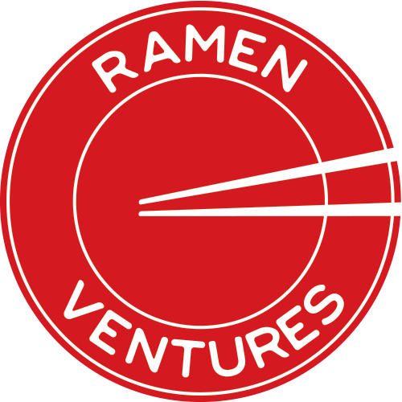

# Ramen Ventures Operating Manual

  

  

We angel invest in founders who will improve the lives of billions.
     
    <a href="https://ramen.vc/"><strong>Website</strong></a>
    ·
    <a href="https://medium.com/ramen-ventures"><strong>Blog</strong></a>
    ·
    <a href="https://angel.co/ramen-ventures"><strong>AngelList</strong></a>
    ·
    <a href="https://twitter.com/RamenVentures"><strong>Twitter</strong></a>
  

---

## Table of Contents

1. [Who We Are](#who-we-are)
2. [Why We Exist](#why-we-exist)
	1. [Our Philosophy](#our-philosophy)
	2. [Our Mission](#our-mission)
3. [How We Help Founders](#how-we-help-founders)
4. [Our Investment Thesis](#our-investment-thesis)
5. [Our Investment Process](#our-investment-process)
	1. [Screening](#screening)
	2. [Meeting](#meeting)
	3. [Learning](#learning)
	4. [Analysis](#analysis)
	5. [Diligence](#diligence)
	6. [Later: Making Follow-On Investments](#making-follow-on-investments)
6. [Working Together](#working-together)
	1. [Getting Started Together](#getting-started-together)
	2. [Staying in Touch](#staying-in-touch)

&nbsp;

## Who We Are

Ramen Ventures is an angel fund in Toronto, Canada. We're run by:

### <a href="http://www.twitter.com/adammcnamara" target="_blank">Adam McNamara</a>

Adam is a founder (3x), angel investor (50+), and first VP Product at Shopify (NYSE: SHOP, $50B).

### <a href="http://www.twitter.com/joshpc" target="_blank">Joshua Tessier</a>

Josh is a founder (3x), angel investor, and first Head of Engineering at Shopify (NYSE: SHOP, $50B)

### <a href="http://www.twitter.com/alizhd" target="_blank">Ali Zahid</a>

Ali founded <a href="http://www.vanhawks.com" target="_blank">Vanhawks</a>, a Y Combinator-backed startup that made the world's first smart carbon fibre bike.

&nbsp;

## Why We Exist

#### Our Philosophy
> “Technology not only moves the human race forward, it’s the only thing that ever has. Without technology, we’re just monkeys playing in the dirt.” \- Naval Ravikant

We believe that everyone should have the opportunity to live a happy, healthy, wealthy, and wise life, and that we should all live sustainably on Spaceship Earth.

#### Our Mission

Our mission is **improve the lives of billions and the long-term future of humanity.** We back founders who are making huge numberes of people happier, healthier, wealthier, and wiser, and making the Earth a better place to live.

## How We Help Founders
We help founders in a few unique ways.

**We're friends first and investors second.**

Our number one priority is that you're healthy and happy. We know how hard being a founder is - we're founders, too. That's why we're friends first and investors second. You can always be honest with us because, no matter what happens, we believe you come first.

**We're independent.**

Unlike VCs, we invest our own money. We'll always act in your long term best interest because our interests are 100% aligned with yours, and no one else.

**We help you grow into World-class founders.**

We know first-hand what it takes to be the founder a World-leading startup. We can coach you on becoming one, too.

**We help you create a World-class company.**

We've hired and lead hundreds of developers, product managers, and UX researchers. We can coach you on how to create a great culture that attracts and grows great people.

**We help you create World-class products.**

We've built products that have scaled to billions of dollars in revenue. We can coach you on how to create massively successful products.

---

The best founders schedule regular coaching sessions with us. They also call, text, and email us all the time asking us for help.

We'll watch your investor updates for opportunities to help, but it's up to you to make the most of us.

&nbsp;

## Our Investment Thesis

First, we look for a startup that's found a group of Users with a important, painful, and valuable Problem. We call this having an "**Important Mission**."

Next, we look for founders who are trying to create an ambitious solution that's first, best, or unique. We call this having a "**Bold Vision**."

Finally, we look for founders with the passion, guts, and ability to actually create it. We call this having the "**Right Team**".

More specifically, we aspire to invest in companies that meet the following criteria:

- **Mission**: You are working to improve the lives of billions (happier, healthier, wealthier, or wiser) or improve the long-term future of humanity.
- **Types of Problems**: Some examples include (but aren't limited to): education, food, health and longevity, financial empowerment, energy production and storage, carbon sequestration, transportation, etc.
- **Enabling Technology**: Uses a new or novel technology to change the World. (ie: VR/AR, AI, Quantum Computing, or some other Frontier Technology.)
- **Stage**: Pre-Seed (ish):
	- **Market**: You've found early adopters in a market that could be big in the future.
	- **Problem**: You've validated a problem that's important, painful, valuable, and underserved.
	- **Solution**: You've validated a vision that's first, best, or unique.
	- **Product**: You're working with early adopters to create and validate your MVP.
- **Founders**: The founding team can design, develop, and distribute your solution.
- **Investment Size**: $100,000 CAD at Pre-Seed, and more in later rounds.

&nbsp;

## Our Investment Process
Our investment process is designed to find companies that fit our thesis while being _extremely_ founder-friendly: fast, honest, and transparent.

---

### Screening
Step 1 is to quickly screen your startup.

#### Goal

To understand, at a high level, what your startup does and whether it fits [our investment thesis](#our-investment-thesis).

#### Questions
We will look at the material you send us and ask ourselves our [Screening Questions](processes/screening_questions.md).

#### What We Need From You
1. Your deck (if you have one)
2. A link to your MVP

#### Next Steps
**If your startup fits our thesis**, continue to [Meeting](#meeting).

**If not**, we share our analysis and feedback.

---

### Meeting
Step 2 is to meet your founding team, preferably face-to-face.

#### Goal

To deeply understand your target users, problem, existing solutions, unique value prop, mission, vision, and team.

#### Questions
When we meet, we'll ask you our [Meeting Questions](/processes/meeting_questions.md).

#### What We Need From You
1. To meet you :)

#### Next Steps
**If we're excited**, start our [Learning](#learning).

**If not**, we share our feedback.

---

### Learning
We've learned from you and now it's time for us to learn from others, too. We'll talk users in your target market to learn about them and their problems. We'll also talk to people who know you about the traits we look for in founders.

#### Goal
To develop a first-hand knowledge of your team, target market, and the problem you're solving.

#### Questions
We'll reach out to your users and people you know and ask them our [Learning Questions](processes/learning_questions.md).

#### What We Need From You
- Evidence of a real user problem
- Intros to 2-3 early users
- Three (3) most recent monthly update emails

#### Next Steps
**If users tell us that this problem is important**, start [Analysis](#analysis).

**If not**, we share our learnings and feedback.

---

### Analysis
Step 4 is where we decide whether your startup really fits [our investment thesis](#our-investment-thesis).

#### Goal

To decide whether we should pursue an investment in your startup.

#### Questions
We write an [Investment Memo](https://docs.google.com/document/d/1Xjd98CxxXduHbx7-rnTT9qj2--B0ZEee9uF7LLwSBcs/edit?pli=1#) to decide whether to invest or not.

#### What We Need From You
Nothing :)

#### Next Steps
**If we want to invest**, start [Investment Diligence](#diligence).

**If not**, we share our analysis.

---

### Diligence
Step 5 is our investment due diligence. It's designed to be lightweight but rigorous enough to uncover any red flags.

#### Goal

To ensure that the company and funding are structured for success.

#### Questions
During this stage of the process we ask ourselves our [Diligence Questions](processes/diligence_questions.md).

#### What We Need From You
Access to a Data Room that includes your:

1. Corporate Documents
	- Shareholder Agreement
	- Director Resolutions
	- Employee Stock Options Plan
	- Cap Table (on a fully diluted basis including all option, note, and warrant holders)
2. Founder Documents
	- Founder Employment Agreements
	- Founder Vesting Agreements
3. Past and Current Financing Documents
	- Subscription/Share Purchase Agreements
	- SAFEs, Kisses, and Convertible Notes
	- Right of First Refusal and Co-Sale Agreements
	- Side Letters
4. Material Contracts
	- Major Supplier Agreements
	- Major Customer Agreements
	- Major Partnership Agreements

#### Next Steps
**If there are no red flags**, we invest and [start helping](#how-we-help-founders).

**If we can't**, we tell you why.

---

## Working Together

Our [mission](#why-we-exist) is to help you be successful, and to do that, we only ask you for two things:

### Getting Started Together

We ask founders to spend some time [Getting Started Together](/processes/getting_started_together.md) with us after we invest.

### Staying In Touch

We ask you to stay in touch by:

1. Providing us with concise and regular [monthly updates](samples/sample_monthly_update.md).
2. Keeping an open and honest communication channel open. Some things shouldn't wait until a monthly update, so reach out whenever you want to talk.

Please don't only share good news; we'll be by your side on the best days and on the worst days.
