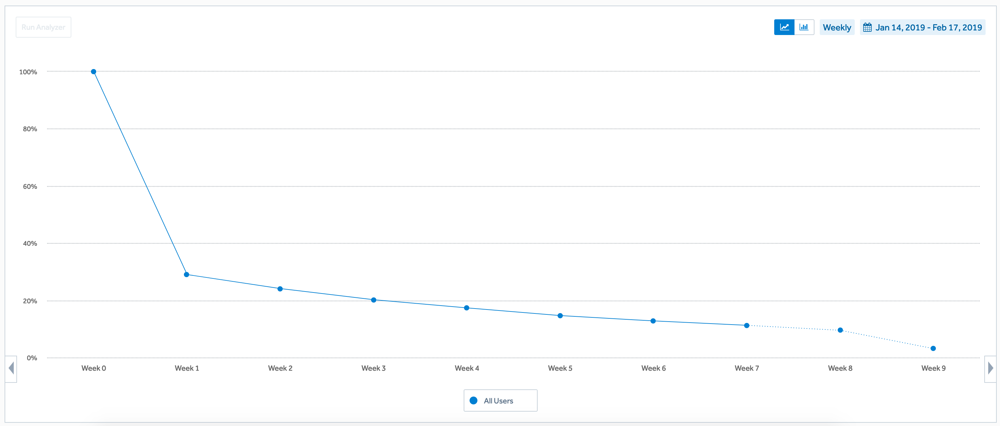
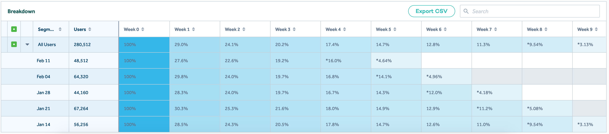

# Sample Update

We ask our companies to send us regular updates so that we can stay up to date with the company, and help out as necessary. To help us help you, here is a sample of what we need to see.

We ask that you spend at most 15-30 minutes filling out this information, as you will want systems in place to easily track this data.

## Outline

* **Our Victories**
* **Our Struggles**
* **Key Metrics**
* **How You Can Help**
* **Other Notes**

---

## Teacher Tools Inc. - May Update

We're excited to move into June after a great school year. We've had our third consequetive month of growth and we've hired two new developers. Unfortunately our spending is a little higher than expected and we're adjusting our plans.

### Our Victories

1. We've grown our customer base in Ontario and Québec, and we're on track to meet our next milestones.
2. Our team spent the last iteration on adding the new dashboard and it shipped on June 8th.

### Our Struggles

1. We're spending an aggressive amount on ads in order to acquire customers.
2. We had mixed feedback on our dashboard so far. We were expecting a more positive response.
3. Our dashboard took three weeks to ship instead of one. We underestimated how complex it would be.

### Key Metrics

#### Business and Financial

1. **User Count**: 2,500
2. **Customer Count (Paying)**: 1,315
3. **Customer Lifetime Value (CLTV)**: $270.00
4. **Customer Acquisition Cost (CAC)**: $233.00
5. **Monthly Recurring Revenue (MRR)**: $19,725 (1315 * $15.00/mo)
6. **MRR Growth Month-over-Month (CMGR)**: 19.54%
7. **Burn Rate**: $17,390/mo
8. **Remaining Runway**: 7 months.

#### Product & Engagement

1. **Monthly Active Users (MAU)**: 805
2. **MAU Growth Month-over-Month**: 25.32%
3. **Monthly Active Customers (MAC)**: 253
4. **MAC Growth Month-over-Month**: 19.83%
5. **Monthly Churn**: 8.35%

#### Retention

*Note: This is a sample set of images, but they should match your data*

### How You Can Help

1. Our new dashboard is not resonating with our users. *Can you help us identify where it's failing them?*
2. We're looking for someone to oversee a launch in Alberta. *Does anyone know a good potential city manager?*
3. We're spending a lot on customers. We're trying to identify if it is a product problem, or a marketing problem. *We'd like some guidance here.*
4. We've identified some challenging technical problems and we need to find someone with expertise in scaling our infrastructure. *Do you know any potential candidates?*

### Other Notes

1. We're expecting next month to be a little quiet as the school year has come to a close. We're looking at interesting ways to keep students and teachers engaged over the break.
2. We're planning a 6-month anniversary celebration, expect pictures to come!